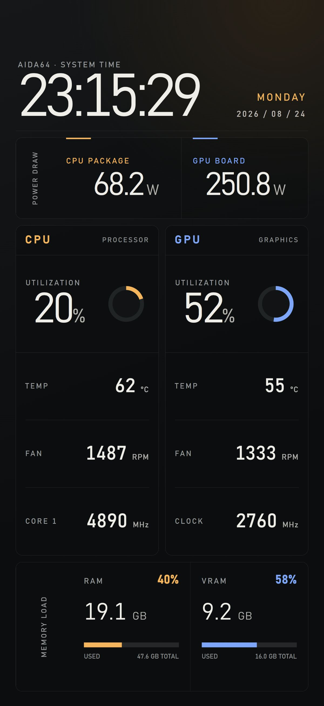

# 曜屏（AIDA64 Panel）

一个面向闲置 Android 手机的 AIDA64 RemoteSensor 专用全屏显示器。它按工作日、周末和中国大陆法定节假日自动控制面板常亮/息屏。



## 下载

前往 [GitHub Releases](https://github.com/qing-yi-5427/aida64-lcd-panel/releases/latest) 下载最新 APK。小米/HyperOS 用户安装后请连接 ADB，并运行仓库根目录的 `configure-hyperos-adb.ps1`。

## 已实现

- 沉浸式全屏显示网页，不保留任何常驻浏览器工具栏。
- 在面板上向上滑动才显示悬浮设置按钮；按钮 5 秒后自动隐藏。
- 向下滑动立即隐藏悬浮设置按钮。
- 支持双指放大、缩小，网页即使原本禁止缩放也会由应用重新启用。
- 二级设置仅保留面板地址、重新加载、亮度与屏幕计划。
- 支持局域网明文 HTTP，适配 AIDA64 RemoteSensor。
- 工作日默认 `02:00–20:30` 亮屏，其余时间息屏。
- 周末/法定节假日默认 `02:00–08:00` 亮屏，其余时间息屏。
- 周六、周日自动按休息日处理；中国大陆法定节假日和调休工作日每周自动同步。
- 内置国务院公布的 2026 年安排作为离线数据，断网时继续正常执行。
- 息屏采用纯黑遮罩、窗口亮度归零并释放常亮锁，让 Android 自然关闭显示并锁屏；恢复时通过系统闹钟入口唤醒并恢复设定亮度。
- 息屏时长按屏幕可临时唤醒 10 分钟。
- 开机及系统时间变化后自动重新安排计划。

## 构建

```powershell
./gradlew.bat assembleDebug
```

APK 输出到 `app/build/outputs/apk/debug/app-debug.apk`。

## 首次使用

1. 首次打开会自动显示设置；以后在面板页面向上滑动，再点击右下角悬浮按钮。
2. 将面板地址改为当前 AIDA64 RemoteSensor 地址，例如 `http://192.168.1.20:8080/`。
3. 点击“开启精确定时权限（推荐）”，在系统设置中允许。
4. 小米/HyperOS 设备连接 ADB 后运行 `./configure-hyperos-adb.ps1`，一次性允许锁屏显示、后台启动和忽略电池优化。

## Android 限制

普通第三方应用不能无条件绕过 PIN/图案/密码；本应用也不会移除设备凭据。它会在计划结束时通过 `AlarmClock` 唤醒屏幕，并以系统允许的锁屏显示窗口直接展示面板。小米/HyperOS 必须额外授予“锁屏显示”权限，脚本已包含该配置。
