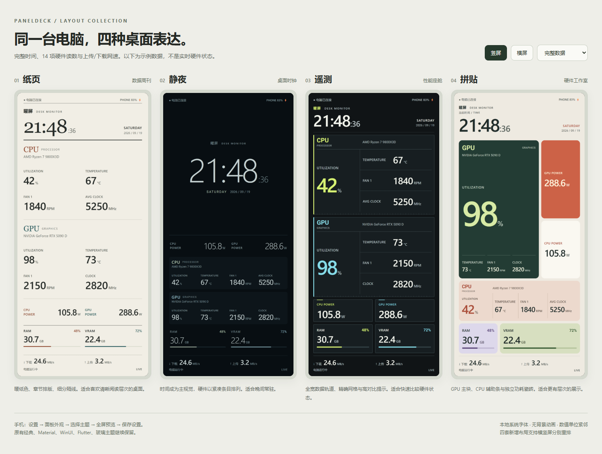
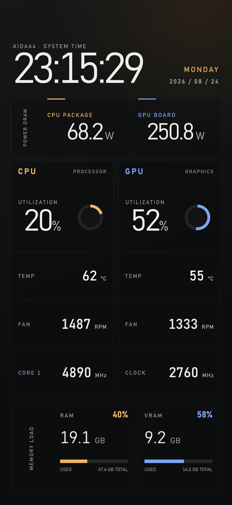

# 曜屏 · PanelDeck

一个 Windows 程序 + 一个 Android APK，让闲置手机成为桌面硬件监控面板。

## 2.5.0

- PC 独立读取 CPU、GPU、内存、风扇和上下行网速，经局域网 HTTP/SSE 发送到手机；日常不依赖 AIDA64、HWiNFO 或 ADB。
- 电脑开机且未睡眠时手机保持亮屏，睡眠、关机或断连后息屏。锁屏、静置和游戏不会触发息屏；亮度由手机系统管理。
- PC 提供设置与临时码配对。主程序普通权限运行，完整硬件采集由用户主动点击 UAC 按钮授权，本次运行内有效；网速无需授权，包含局域网流量。
- 手机内置九套主题：经典、Material、WinUI、Flutter、玻璃，以及新增纸页、静夜、遥测、拼贴。所有主题保留完整时间，新增四套支持横竖屏独立布局，设置中可预览和切换。
- PC 精简包约 2.6 MB，复用 x64 .NET 10 Desktop / ASP.NET Core 运行时；启动助手检测缺失组件，用户主动点击后才安装。



## 下载与使用

在 [GitHub Releases](https://github.com/qing-yi-5427/aida64-lcd-panel/releases/latest) 下载 `PanelDeck-PC-2.5.0-Lite.zip` 和 `PanelDeck-Android-2.5.0.apk`。APK 当前采用开发签名，供直接安装与测试，不是应用商店发行版本。

1. 解压 PC 包，保留整个文件夹，运行 `PanelDeck.Launcher.exe`。更新前从托盘完整退出旧版。
2. 安装 APK，手机与电脑连接同一可信局域网。
3. 在 PC 设置中允许局域网连接、生成配对码，在手机设置中填入电脑地址和配对码并保存。日常 USB 仅用于充电。
4. 在手机“面板外观”中选择主题；需要 CPU 温度等完整读数时，在 PC 主界面主动点击“授权完整读取（UAC）”。

完整使用方法、HyperOS 权限与边界见 [电脑端说明](desktop/README.md)；样式说明见 [主题文档](panel/THEMES.md)；验证结果见 [验证记录](desktop/VALIDATION.md)。

## 构建两端

需要 Windows、.NET 10 SDK、JDK 17+ 和 Android SDK。Android 本地 SDK 路径配置在忽略提交的 `local.properties` 或环境变量中。

```powershell
./desktop/build-desktop.ps1 -FrameworkDependent
./gradlew.bat assembleDebug
```

PC 输出到 `artifacts/PanelDeck-Desktop-Lite/`，APK 输出到 `app/build/outputs/apk/debug/app-debug.apk`。省略 `-FrameworkDependent` 可构建附带运行时的 PC 包。源码、测试和构建脚本入库，安装包放在 Releases；构建缓存、设备数据、密钥及临时截图不入库。

本次本地最新 PC 目录为 `artifacts/PanelDeck-Desktop-Update/`。`./clean-workspace.ps1` 只预览清理列表；加 `-Apply` 才删除构建缓存和旧产物，保留该目录及当前版本 APK，不清理源码或用户配置。清理前需退出 PC 程序，压缩下载包应先上传 Releases。

## 旧版 AIDA64 网页面板模式

以下为仍保留的兼容模式，可在手机设置中切回。原始 `.rslcd` 模板与 `design-previews/` 是历史设计参考。

一个面向闲置 Android 手机的 AIDA64 RemoteSensor 专用全屏显示器。它按工作日、周末和中国大陆法定节假日自动控制面板常亮/息屏。

<p align="center">
  
</p>

## 下载

前往 [GitHub Releases](https://github.com/qing-yi-5427/aida64-lcd-panel/releases/latest) 下载最新 APK。小米/HyperOS 用户安装后请连接 ADB，并运行仓库根目录的 `configure-hyperos-adb.ps1`。

## 已实现

- 沉浸式全屏显示网页，不保留任何常驻浏览器工具栏。
- 在面板上向上滑动才显示悬浮设置按钮；按钮 5 秒后自动隐藏。
- 向下滑动立即隐藏悬浮设置按钮。
- 支持双指放大、缩小，网页即使原本禁止缩放也会由应用重新启用。
- 顶部显示手机实时电量与充电状态；低电量、充电和正常状态使用不同仪表色提示。
- 设置提供面板主题、面板地址、重新加载与屏幕计划；亮度由手机系统管理。
- 支持局域网明文 HTTP，适配 AIDA64 RemoteSensor。
- 工作日默认 `02:00–20:30` 亮屏，其余时间息屏。
- 周末/法定节假日默认 `02:00–08:00` 亮屏，其余时间息屏。
- 周六、周日自动按休息日处理；中国大陆法定节假日和调休工作日每周自动同步。
- 内置国务院公布的 2026 年安排作为离线数据，断网时继续正常执行。
- 息屏采用纯黑遮罩并释放常亮锁，让 Android 自然关闭显示；恢复时通过系统允许的唤醒入口显示面板，始终使用系统亮度。
- 息屏时长按屏幕可临时唤醒 10 分钟。
- 开机及系统时间变化后自动重新安排计划。

## 构建

```powershell
./gradlew.bat assembleDebug
```

APK 输出到 `app/build/outputs/apk/debug/app-debug.apk`。

## 首次使用

1. 首次打开会自动显示设置；以后在面板页面向上滑动，再点击右下角悬浮按钮。
2. 将面板地址改为当前 AIDA64 RemoteSensor 地址，例如 `http://192.168.1.20:8080/`。
3. 点击“开启精确定时权限（推荐）”，在系统设置中允许。
4. 小米/HyperOS 设备连接 ADB 后运行 `./configure-hyperos-adb.ps1`，一次性允许锁屏显示、后台启动和忽略电池优化。

## Android 限制

普通第三方应用不能无条件绕过 PIN/图案/密码；本应用也不会移除设备凭据。它会在计划结束时通过 `AlarmClock` 唤醒屏幕，并以系统允许的锁屏显示窗口直接展示面板。小米/HyperOS 必须额外授予“锁屏显示”权限，脚本已包含该配置。
